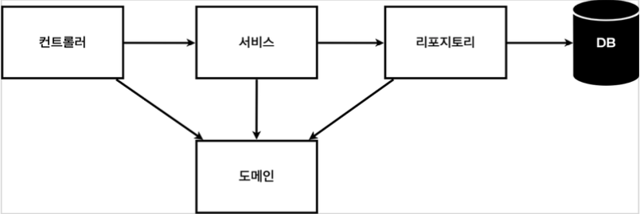

# Spring bean을 등록하는 방법 
### 어플리케이션 계층 구조 

- 컨트롤러: 웹 MVC의 컨트롤러 역할
- 서비스: 핵심 비즈니스 로직 구현
- 리포지토리: 데이터베이스에 접근, 도메인 객체를 DB에 저장하고 관리
- 도메인: 비즈니스 도메인 객체, 예) 회원, 주문, 쿠폰 등등 주로 데이터베이스에 저장하고 관리됨

### 1. 컴포넌트 스캔과 자동 의존관계 설정 
- 생성자에 @Autowired 가 있으면 스프링이 연관된 객체를 스프링 컨테이너에서 찾아서 넣어준다. 
- 이렇게 객체 의존관계를 외부에서 넣어주는 것을 DI (Dependency Injection), 의존성 주입이라 한다.
- @Component 애노테이션이 있으면 스프링 빈으로 자동 등록된다.
- @Controller 컨트롤러가 스프링 빈으로 자동 등록된 이유도 컴포넌트 스캔 때문이다.
- @Component 를 포함하는 다음 애노테이션도 스프링 빈으로 자동 등록된다.
  `@Controller`, `@Service`, `@Repository`
- 자바 코드로 직접 스프링 빈 등록하기
- `@Autowired`로 의존성을 주입하는 범위  → `@SpringBootApplication`의 하위 패키지
```java
@Controller
  public class MemberController {
      private final MemberService memberService;
      @Autowired
      public MemberController(MemberService memberService) {
          this.memberService = memberService;
      }
}
```

### 2. 자바 코드로 직접 스프링 빈 등록하기 
```java
@Configuration
public class SpringConfig {
    @Bean
    public UserService userService() {
        return new UserService(userRepository());
    }

    @Bean
    public UserRepository userRepository() {
        return new MemoryUserRepository();
    }
}
```
### 참고
- 실무에서는 주로 정형화된 컨트롤러, 서비스, 리포지토리 같은 코드는 컴포넌트 스캔을 사용한다.
- 정형화 되지 않거나, 상황에 따라 구현 클래스를 변경해야 하면 설정을 통해 스프링 빈으로 등록한다.
  → 다른 코드를 변경할 필요 없이 configuration파일만 변경하면 된다.
- @Autowired 를 통한 DI는 helloConroller , memberService 등과 같이 스프링이 관리하는 객체에서만 동작한다. 스프링 빈으로 등록하지 않고 내가 직접 생성한 객체에서는 동작하지 않는다